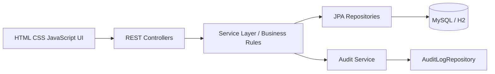
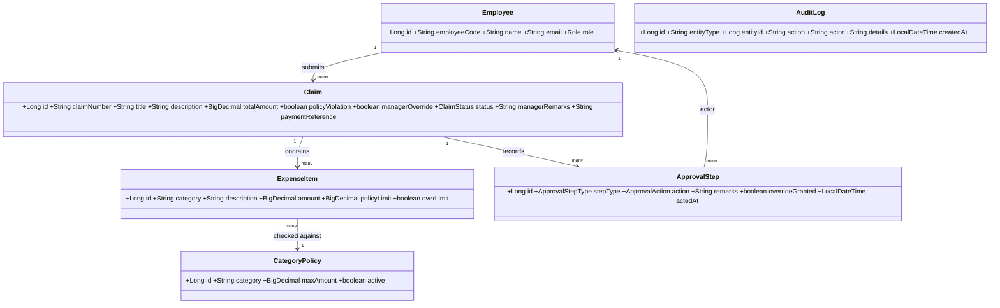
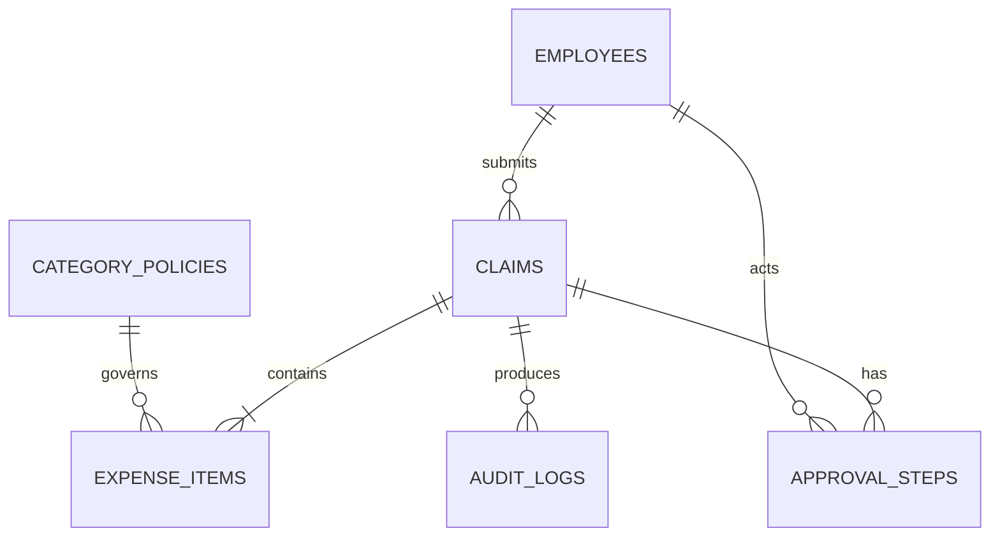
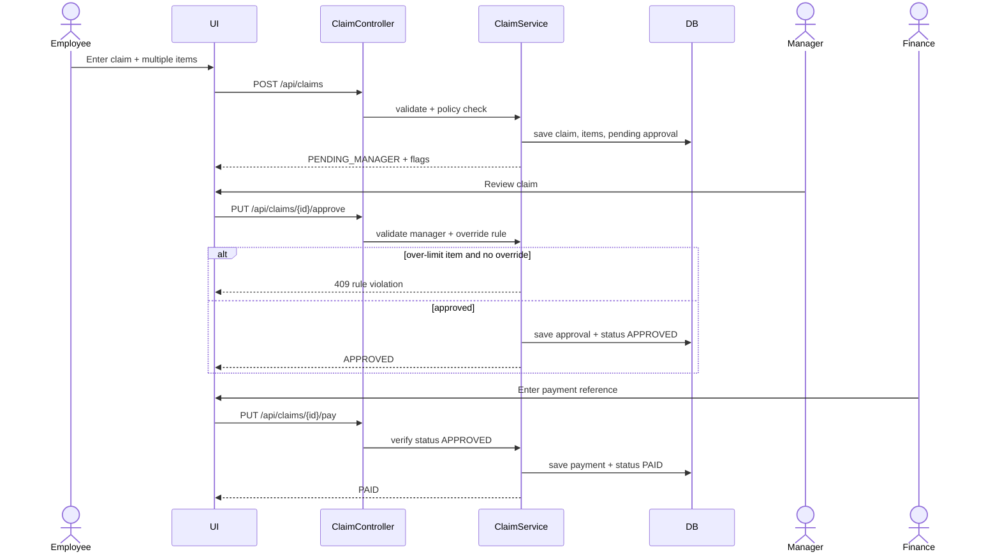

# ExpenseClaim — Architecture and Design

## Layered architecture

```mermaid
flowchart LR
UI[HTML CSS JavaScript UI] --> C[REST Controllers]
C --> S[Service Layer / Business Rules]
S --> R[JPA Repositories]
R --> DB[(MySQL / H2)]
S --> A[Audit Service]
A --> R2[AuditLogRepository]
```

## UML class diagram

```mermaid
classDiagram
class Employee { +Long id +String employeeCode +String name +String email +Role role }
class Claim { +Long id +String claimNumber +String title +String description +BigDecimal totalAmount +boolean policyViolation +boolean managerOverride +ClaimStatus status +String managerRemarks +String paymentReference }
class ExpenseItem { +Long id +String category +String description +BigDecimal amount +BigDecimal policyLimit +boolean overLimit }
class ApprovalStep { +Long id +ApprovalStepType stepType +ApprovalAction action +String remarks +boolean overrideGranted +LocalDateTime actedAt }
class CategoryPolicy { +Long id +String category +BigDecimal maxAmount +boolean active }
class AuditLog { +Long id +String entityType +Long entityId +String action +String actor +String details +LocalDateTime createdAt }
Employee "1" --> "many" Claim : submits
Claim "1" --> "many" ExpenseItem : contains
Claim "1" --> "many" ApprovalStep : records
ApprovalStep "many" --> "1" Employee : actor
ExpenseItem "many" --> "1" CategoryPolicy : checked against
```

## ER diagram

```mermaid
erDiagram
EMPLOYEES ||--o{ CLAIMS : submits
CLAIMS ||--|{ EXPENSE_ITEMS : contains
CLAIMS ||--o{ APPROVAL_STEPS : has
EMPLOYEES ||--o{ APPROVAL_STEPS : acts
CATEGORY_POLICIES ||--o{ EXPENSE_ITEMS : governs
CLAIMS ||--o{ AUDIT_LOGS : produces
```

## Workflow / sequence

```mermaid
sequenceDiagram
actor Employee
participant UI
participant ClaimController
participant ClaimService
participant DB
actor Manager
actor Finance
Employee->>UI: Enter claim + multiple items
UI->>ClaimController: POST /api/claims
ClaimController->>ClaimService: validate + policy check
ClaimService->>DB: save claim, items, pending approval
ClaimService-->>UI: PENDING_MANAGER + flags
Manager->>UI: Review claim
UI->>ClaimController: PUT /api/claims/{id}/approve
ClaimController->>ClaimService: validate manager + override rule
alt over-limit item and no override
ClaimService-->>UI: 409 rule violation
else approved
ClaimService->>DB: save approval + status APPROVED
ClaimService-->>UI: APPROVED
end
Finance->>UI: Enter payment reference
UI->>ClaimController: PUT /api/claims/{id}/pay
ClaimController->>ClaimService: verify status APPROVED
ClaimService->>DB: save payment + status PAID
ClaimService-->>UI: PAID
```
